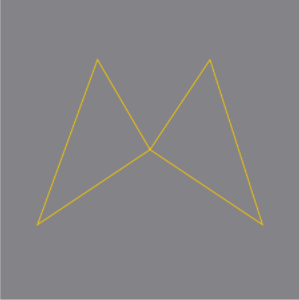

# 2022 - February 23 Documentation

## What I Did

First of all, I made a new Xcode project named "Paths Demo" and made it a SwiftUI project type. Then I made a "GeometryReader" object in the body of the "ContentView.swift" and added
a frame around that with a width and height of "300x300" and alignment ".center". After all that, I made a Path object inside the "GeometryReader" and first added a path move object
to the center. Next I started adding the lines with the "addLine()" objects, which I did twice per side and then "closeSubpath()" objects per each side after the initial two "addLine"
objects. After that I added a ".stroke(.yellow)" and ".background(.gray)" objects around the "Path" object. This scales correctly on any device with how I multiplied and divided sym-
metrically. Lastly, I added a "RadialGradient()" object "fill" on the "Path" object that matches what I have on my original logo. I think it turned out pretty nice!
